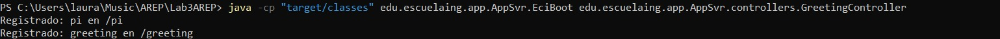
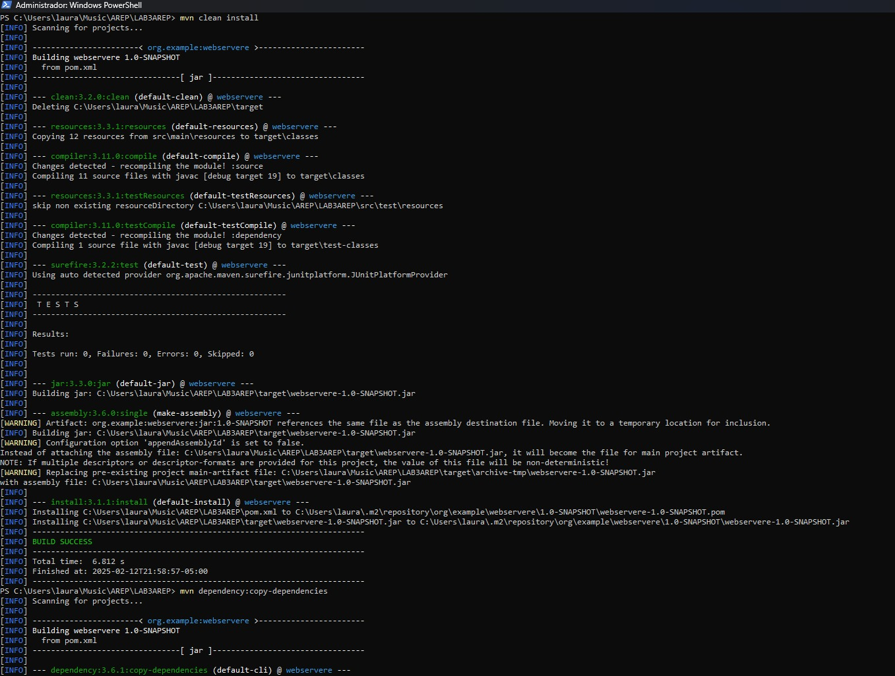
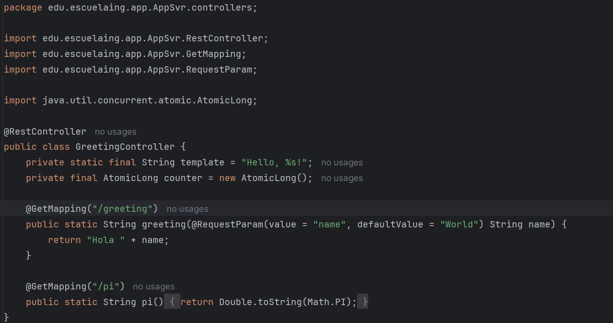
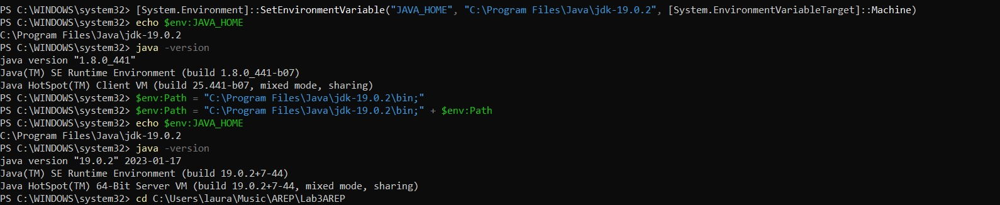

# Lab3 AREP

Para este taller los estudiantes deberán construir un servidor Web (tipo Apache) en Java. El servidor debe ser capaz de entregar páginas html e imágenes tipo PNG. Igualmente el servidor debe proveer un framework IoC para la construcción de aplicaciones web a partir de POJOS. Usando el servidor se debe construir una aplicación Web de ejemplo. El servidor debe atender múltiples solicitudes no concurrentes.

Para este taller desarrolle un prototipo mínimo que demuestre las capacidades reflexivas de JAVA y permita por lo menos cargar un bean (POJO) y derivar una aplicación Web a partir de él.

Debe entregar su trabajo al final del laboratorio. Luego puede complementar para entregarlo en 8 días. Se verificara y compararán el commit del día de inicio del laboratorio y el dela entrega final.

## Comenzando

Se debe clonar el proyecto localmente con el comando:

` git clone https://github.com/lalaro/Lab1AREP.git`

Y luego revisar las intrucciones a continuación para el manejo de soluciones del proyecto.

El desarrollo del Laboratorio es el siguiente:

Como arquitectura tenemos:

Explicación de arquitectura: 

Este diagrama representa una arquitectura de sistema distribuido que involucra un cliente web, un servidor HTTP y un servidor backend, todos comunicándose a través de una red local. El cliente web realiza solicitudes al servidor HTTP, quien a su vez puede solicitar datos JSON al servidor backend. Además, el servidor HTTP sirve archivos estáticos (HTML, CSS, JS, PNG, JPEG) directamente al cliente.
En el diagrama se establece el puerto 35000 utilizado para la comunicación y la especificación de la ruta GET. El Local Server indica que todos los componentes residen en el mismo entorno local.

Desarrollo del lab:

1. Para su primera versión cargue el POJO desde la línea de comandos , de manera similar al framework de TEST. Es decir pásela como parámetro cuando invoque el framework. Ejemplo de invocación:

java -cp target/classes co.edu.escuelaing.reflexionlab.MicroSpringBoot co.edu.escuelaing.reflexionlab.FirstWebService

Debemos tener en cuenta que este comando cambiara porque se va implementar en el servidor y todo va estar sobre la clase de **WebApplication**

Entonces tendremos 

2. Atienda la anotación @GetMapping publicando el servicio en la URI indicada, limítelo a tipos de retorno String,  ejemplo:

@RestController
public class HelloController {

	@GetMapping("/")
	public String index() {
		return "Greetings from Spring Boot!";
	}
}

Nuestro servicio será la clase **GreetingController**

3. En su versión final el framework debe explorar el directorio raiz (o classpath) buscando classes con una anotación que indique que son componentes, por ejemplo @RestController y cargar todos los que tengan dicha anotación. Así no tendrá que especificarlos siempre en la línea de comandos.

4.  Debe soportar también @GetMapping y debe soportar @RequestParam.

5. Debe ser posible impelmentar el siguiente componente:

@RestController
public class GreetingController {

	private static final String template = "Hello, %s!";
	private final AtomicLong counter = new AtomicLong();

	@GetMapping("/greeting")
	public Greeting greeting(@RequestParam(value = "name", defaultValue = "World") String name) {
		return "Hola " + name;
	}
}

### Prerrequisitos

Se necesita de Maven (La versión más reciente) y Java 19, la instalación debe realizarse desde las paginas oficiales de cada programa.

### Instalación

Para Maven debe irse a https://maven.apache.org/download.cgi, descargar la versión más nueva que allá de Maven (En este caso tenemos la versión 3.9.6) y agregarse en la carpeta de Program Files, luego se hace la respectiva configuración de variables de entorno según la ubicación que tenemos para el archivo de instalación, tanto de MAVEN_HOME y de Path.
Luego revisamos que haya quedado bien configurado con el comando para Windows:

` mvn - v `
o
` mvn -version `

Para Java debe irse a https://www.oracle.com/java/technologies/downloads/?er=221886, descargar la versión 19 de Java y agregarse en la carpeta de Program Files, luego se hace la respectiva configuración de variables de entorno según la ubicación que tenemos para el archivo de instalación, tanto de JAVA_HOME y de Path.
Luego revisamos que haya quedado bien configurado con el comando para Windows:

` java -version `

Si no tenemos la versión solicitada podemos hacer lo siguiente, para el caso de Windows:

Ir al Windows PowerShell y ejecutar como administrador los siguientes codigos:

` [System.Environment]::SetEnvironmentVariable("JAVA_HOME", "C:\Program Files\Java\jdk-19.0.2", [System.EnvironmentVariableTarget]::Machine) ` 

Revisar las rutas de la máquina

`  $env:JAVA_HOME = "C:\Program Files\Java\jdk-19.0.2" `

`  $env:Path = "C:\Program Files\Java\jdk-19.0.2\bin;" + $env:Path `

`  echo $env:JAVA_HOME `

`  javac -version `

`  java -version `

Así se debe ver:

## Ejecutando las pruebas

Podemos Abrir en terminal el proyecto y ejecutar las pruebas desde el PowerShell, en el caso de Windows. Y ejecutamos el comando:

` mvn test `

O de igual forma en el ID que deseemos.

Así se vera:

### Desglose en pruebas de extremo a extremo

### Y pruebas de estilo de código

## Despliegue

Podemos Abrir en terminal el proyecto y compilar y empaquetar el proyecto desde el PowerShell, en el caso de Windows. Y ejecutamos los comandos:

` mvn clean `

` mvn compile `

` mvn package `

O de igual forma en el ID que deseemos.

Así se vera:

## Construido con

* [Maven](https://maven.apache.org/) - Gestión de dependencias.
* [Java](https://www.java.com/es/) - Versionamiento en Java.

## Contribuyendo

Por favor, lee [CONTRIBUTING.md](https://gist.github.com/PurpleBooth/b24679402957c63ec426) para detalles sobre nuestro código de conducta y el proceso para enviarnos solicitudes de cambios (*pull requests*).

## Versionado

Usamos [SemVer](http://semver.org/) para el versionado.

## Autores

* **Laura Valentina Rodríguez Ortegón** - *Lab2 AREP* - [Repositorio](https://github.com/lalaro/Laboratorio-2AREP.git)

## Licencia

Este proyecto está licenciado bajo la Licencia MIT - consulta el archivo [LICENSE.md](LICENSE.md) para más detalles.

## Reconocimientos

* Agradecimientos a la Escuela Colombiana de Ingeniería
* La documentación de Git Hub
* Al profesor Luis Daniel Benavides
